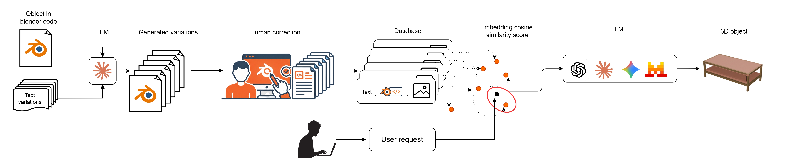

# BlenderRAG

**High-Fidelity 3D Object Generation via Retrieval-Augmented Code Synthesis**

Massimo Rondelli, Francesco Pivi, Maurizio Gabbrielli

[](https://arxiv.org/abs/2605.00632)
[](https://huggingface.co/datasets/MaxRondelli/BlenderRAG)
[](https://huggingface.co/papers/2605.00632)
[](https://maxrondelli.github.io/BlenderRAG/)
[](LICENSE)

> **Project page:** <https://maxrondelli.github.io/BlenderRAG/> &nbsp;·&nbsp; **Paper:** [arXiv:2605.00632](https://arxiv.org/abs/2605.00632) &nbsp;·&nbsp; **Dataset:** [HF Hub](https://huggingface.co/datasets/MaxRondelli/BlenderRAG)

---

## Abstract

Generating high-fidelity 3D content from natural language remains an open problem.
End-to-end mesh generators tend to produce low-fidelity geometry; pure code-driven
approaches struggle with the breadth of Blender's API and frequently emit invalid
scripts. We propose **BlenderRAG**, a retrieval-augmented code-synthesis system
that conditions a large language model on semantically retrieved
*(description, code)* pairs from a curated dataset of 500 hand-authored Blender
scripts. The model emits executable Blender Python that, when run, produces a
clean editable mesh in a live Blender session. We release the dataset, a
companion Blender add-on, and a project page for reproducibility.

## Contents

1. [Method](#method)
2. [Project Page & Demo](#project-page--demo)
3. [Dataset](#dataset)
4. [Installation](#installation)
5. [Add-on Setup](#add-on-setup)
6. [Usage](#usage)
7. [Repository Layout](#repository-layout)
8. [Troubleshooting](#troubleshooting)
9. [Authors](#authors)
10. [Citation](#citation)
11. [License](#license)

## Method

<p align="center">
  
</p>

Given a natural-language description, BlenderRAG executes the following pipeline:

1. **Embed.** The query is encoded with a Nomic-AI sentence-embedding model.
2. **Retrieve.** The top-*k* most similar *(description, code)* pairs are
   retrieved from a local Qdrant vector database initialised on first launch.
3. **Synthesize.** A user-selected LLM is prompted with the query and the
   retrieved exemplars; it returns a Blender Python script.
4. **Execute.** The script is run in the active Blender session.
5. **Edit.** The resulting mesh is left selected in the viewport, ready for
   downstream editing.

The vector database is built once per machine and re-used across sessions.

## Project Page & Demo

The project page hosts a static site that streams meshes, code, and descriptions
directly from the Hugging Face dataset:

> <https://maxrondelli.github.io/BlenderRAG/>

It includes (i) a continuous gallery of 50 categories rendered live as 3D meshes
via [`<model-viewer>`](https://modelviewer.dev/), (ii) a shuffleable curated
sample of variants, (iii) a per-variant view showing the rotating mesh, the
original render, the description, and the generating script, and (iv) a short
walkthrough video of the add-on in use.

To enable Pages on a fresh fork, set
**Settings → Pages → Source: Deploy from a branch → Branch: `main` / `/docs`**.

## Dataset

The [BlenderRAG dataset](https://huggingface.co/datasets/MaxRondelli/BlenderRAG)
ships **500 objects** organised into **50 categories** (25 indoor, 25 outdoor),
with **10 variants per category**. Each variant comprises three artifacts:

| File | Type | Description |
|---|---|---|
| `imageN.png` | PNG | Cycles-rendered preview of the mesh |
| `codeN.py`   | Python | Blender script that generates the mesh |
| `txtN.txt`   | UTF-8 text | Natural-language description used for retrieval |

Splits `indoor` and `outdoor` are also available as Parquet files for direct
ingestion via 🤗 `datasets`.

```python
from datasets import load_dataset
ds = load_dataset("MaxRondelli/BlenderRAG")
print(ds)            # DatasetDict({indoor: ..., outdoor: ...})
```

## Installation

**Requirements**

- Blender ≥ 4.0
- Python 3.12
- An LLM API key (only required for closed-source providers)

```bash
git clone https://github.com/MaxRondelli/BlenderRAG.git
cd BlenderRAG

conda create -n blender_rag python=3.12 -y
conda activate blender_rag
pip install -r requirements.txt
```

## Add-on Setup

**1. Install the add-on in Blender.**
Zip the repository and load it via *Edit → Preferences → Add-ons →
Install from Disk*. After installation, open the BlenderRAG panel from the 3D
viewport sidebar (<kbd>N</kbd>).

**2. Install runtime dependencies.**
In the BlenderRAG panel, click *Install Dependencies*. Track progress in the
Blender Python Console:

- *Windows*: Window → Toggle System Console
- *macOS / Linux*: Scripting workspace → Python Console

Restart Blender after installation completes.

**3. Configure the add-on.**

| Setting | Description |
|---|---|
| LLM Selection | Choose your preferred language model (open or closed source). |
| API Key | Required for closed models. |
| Retrieval Count (`k`) | Number of similar examples retrieved from the vector DB. |

## Usage

1. Open the BlenderRAG panel in the 3D viewport sidebar.
2. Enter a description, e.g. *"a modern wooden chair with armrests"*.
3. Click **Generate**.

On the first prompt the system initialises the local Qdrant vector store and
indexes the dataset; this is a one-time cost. Subsequent generations are fast.
Larger values of *k* yield more grounded outputs at the cost of latency; smaller
values are more open-ended.

## Repository Layout

```
BlenderRAG/
├── __init__.py                 # Add-on entry point
├── operators.py                # Blender operators
├── panels.py                   # Sidebar UI
├── properties.py               # Add-on settings
├── llm.py                      # LLM client wrappers
├── rag.py                      # Retrieval pipeline
├── vector_store.py             # Qdrant wrapper
├── dataset_json_creation.py    # Dataset preprocessing
├── config.py                   # Constants and paths
├── utils.py
├── requirements.txt
├── assets/                     # Pipeline diagram and figures
└── docs/                       # Project page (GitHub Pages)
    ├── index.html
    ├── app.js
    ├── style.css
    ├── data.js
    ├── meshes/                 # Pre-exported .glb meshes
    └── assets/                 # Walkthrough video
```

## Troubleshooting

<details>
<summary>The add-on does not appear after installation.</summary>

Open *Edit → Preferences → Add-ons*, search for "BlenderRAG", and tick the
checkbox.
</details>

<details>
<summary>Dependency installation fails.</summary>

Verify that Blender has network access and was launched with sufficient
permissions. On Windows, run Blender as Administrator and retry.
</details>

<details>
<summary><code>ModuleNotFoundError</code> after installing dependencies.</summary>

Restart Blender. Dependencies installed at runtime are only loaded after a
fresh start.
</details>

<details>
<summary>The first prompt is slow.</summary>

Expected behaviour: the local Qdrant index is being built. Subsequent prompts
are several orders of magnitude faster.
</details>

<details>
<summary>The generated script fails to execute.</summary>

Inspect the Blender System Console for the traceback. Common causes are
unsupported Blender versions or invalid API keys. Increasing *k* often produces
more grounded scripts.
</details>

## Authors

| Author | Affiliation |
|---|---|
| **Massimo Rondelli** | Department of Computer Science and Engineering, University of Bologna |
| **Francesco Pivi** | Department of Computer Science and Engineering, University of Bologna · Ferrari S.p.A. |
| **Maurizio Gabbrielli** | Department of Computer Science and Engineering, University of Bologna |

## Citation

```bibtex
@misc{rondelli2026blenderraghighfidelity3dobject,
  title         = {BlenderRAG: High-Fidelity 3D Object Generation via Retrieval-Augmented Code Synthesis},
  author        = {Massimo Rondelli and Francesco Pivi and Maurizio Gabbrielli},
  year          = {2026},
  eprint        = {2605.00632},
  archivePrefix = {arXiv},
  primaryClass  = {cs.CV},
  url           = {https://arxiv.org/abs/2605.00632},
}
```

## License

Released under the [MIT License](LICENSE).
